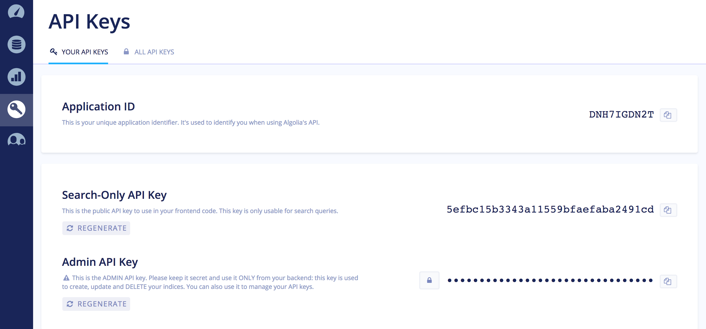

# [AlgoSearch](https://github.com/jaimemendozadev/algo-search.git)

A mock-up App Store that uses the [Algolia](https://www.algolia.com/) search-as-a-service API for ⚡️ fast search results.


## Table of contents

- Initial Setup
- Algolia Account Sign Up
- Create a `.env` File
- Seeding Mock Data
- Starting the App
- Future +Plus Features
- Created By

## Initial Setup

Open up your terminal and clone the repo locally to your computer by running the following command at the target destination: `$ git clone https://github.com/jaimemendozadev/algo-search.git`


## Algolia Account Sign Up

You'll need to [create an Algolia account](https://www.algolia.com/users/sign_up) and get your App ID and API keys to seed the Algolia index and get the app to work. 

*Note*: When we say `index`, think `database`.


After creating an account, look at the [Header of the Dashboard](https://www.algolia.com/doc/tutorials/getting-started/getting-started-with-the-dashboard/?language=javascript#dashboard-layout) and write down your App ID. It'll go in the `.env` under the `ALGOLIA_APP_ID` variable (see [Create a `.env` File](#create-a-.env-file) section).

The [documentation](https://www.algolia.com/doc/) on the Algolia website should help if you have a question regarding the functionality of the API.

Next, [navigate the dashboard](https://www.algolia.com/doc/tutorials/getting-started/getting-started-with-the-dashboard/#the-sidebar-menu) to the API Keys section. 



You'll need to get the `Search-Only API Key` to search for app results on the frontend and the `Admin API Key` to initially setup and seed your index. Both will respectively go in the `ALGOLIA_PUBLIC_SEARCH_API_KEY` and `ALGOLIA_SECRET_API_KEY` variables of your `.env` file (see [Create a `.env` File](#create-a-.env-file) section). 

You will also need to create another API Key to handle `POST` and `DELETE` requests on the Node server. This API Key will should be placed in the `.env` file under the `ALGOLIA_SECRET_SERVER_KEY` variable. Please see the Algolia docs on [API Key creation](https://www.algolia.com/doc/guides/security/api-keys/#generating-api-keys) and make sure the API key has the right permissions for adding and deleting objects. 


## Create a `.env` File

Fire up your terminal and create a new `.env` by simply running `$ touch .env.`

After creating the `.env` file, use your text editor to enter all the necessary credentials, urls, and app variables (like the Server Port) into separate lines inside the `.env` file. 

Do not end a line with punctuation or spacing. The `.env` should appear like the following snippet:

```
PORT = ENTER_VALUE_HERE

ALGOLIA_APP_ID = ENTER_APP_ID_HERE

ALGOLIA_INDEX_NAME = ENTER_ALGOLIA_INDEX_NAME_HERE

ALGOLIA_PUBLIC_SEARCH_API_KEY = ENTER_PUBLIC_SEARCH_API_KEY_HERE

ALGOLIA_SECRET_SERVER_KEY = ENTER_SECRET_SERVER_KEY_HERE

ALGOLIA_SECRET_API_KEY = ENTER_SECRET_API_KEY_HERE
```

For the `PORT`, just enter 3000. 

The `ALGOLIA_INDEX_NAME` can be whatever you want it to be. Just make sure it's [Snake cased](https://en.wikipedia.org/wiki/Snake_case) (e.g. `my_algolia_index_name`);

After creating the `.env` and you fire up the app, the key value pairs in the file will correspond to any line of code that references `process.env`.


## Seeding Mock Data

Now you're ready to seed your Algolia index. If you're curious, you can go to `seed/index.js` to see all the configuration settings for the Algolia Index.

This project uses the [Yarn package manager](https://yarnpkg.com/en/). Go to the Yarn website to learn more about how to install the package manger on your computer.

In the root of the app, use your terminal to run `$ yarn run seed` to seed the Algolia index. You should see a message in the terminal that says `Algolia Index has Seed Data!`.


## Starting the App

In the root of the app, use your terminal to run `$ yarn install` to install all the app dependencies. Wait until everything finishes loading.

In the same terminal window, run `$ yarn run dev:build` to build all the dependencies. Wait until everything finishes building.

Finally in another opened terminal tab, run the command `$ yarn run dev:start` to start the app.

Go to `http://localhost:3000` in your favorite browser to view the website. 

Remember, you can always stop the server from running by typing `Control + z` in the terminal window you used to start the app.


## Future +Plus Features


## Created By

**Jaime Mendoza**
[https://github.com/jaimemendozadev](https://github.com/jaimemendozadev)